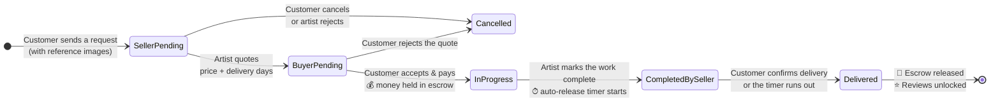
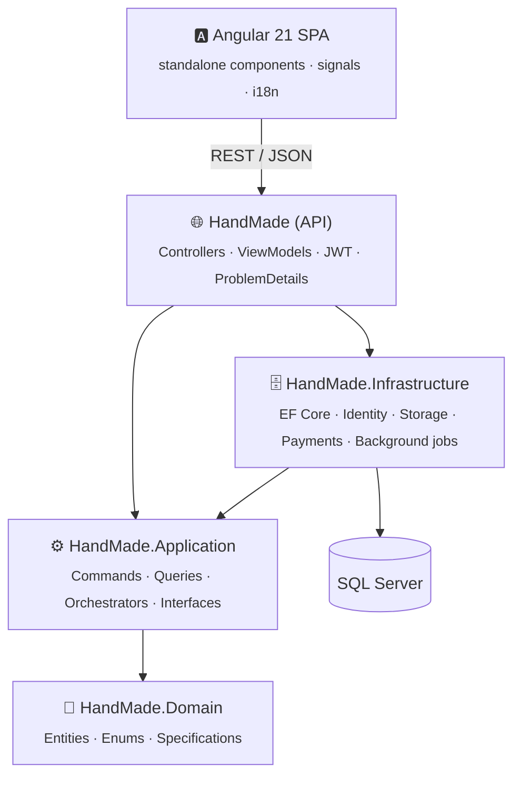

<div align="center">

# 🎨 HandMade

### Art on Demand — a marketplace where custom handmade work is negotiated, paid for, and delivered with escrow protection

HandMade connects customers with independent artists for **custom handmade pieces**.
A customer describes what they want and attaches reference images, the artist replies with a price and a timeline, and when the customer accepts, the platform **charges the customer and holds the money in escrow** until the delivery is confirmed.


[Features](#-features) •
[How an order works](#-how-an-order-works) •
[Architecture](#-architecture) •
[Tech stack](#-tech-stack) •
[Getting started](#-getting-started) •
[API overview](#-api-overview)

</div>

---

## 💡 Why HandMade?

Ordering custom handmade work online is risky for both sides:

- **Customers** worry about paying up front for something that doesn't exist yet.
- **Artists** worry about spending days on a piece and never getting paid.

HandMade fixes this with a **negotiate → pay → hold → release** flow. The price is agreed before any money moves, the platform holds the payment while the artist works, and the artist is paid once the customer confirms delivery. If the customer never responds, the money is **released to the artist automatically** after a set number of days, so nobody's funds are stuck.

---

## ✨ Features

<table>
<tr>
<td valign="top" width="33%">

### 🛍️ Customers
- Browse a storefront by category, subcategory and shop
- Search, filter and sort products
- Product pages with images, ratings and reviews
- **Request a custom piece** with reference images
- Cart with **checkout that turns each item into its own order**
- Accept or reject the artist's quote
- Pay on acceptance, with the payment **held in escrow**
- Track orders and confirm delivery
- Manage multiple addresses and pick a default
- Review products and shops after delivery

</td>
<td valign="top" width="33%">

### 🧑‍🎨 Artists
- Open a shop, which an admin approves
- Shop dashboard with active and inactive products
- Add products with images, price, delivery time and status
- Incoming order requests list
- **Quote a price and delivery time**, or reject the request
- Mark work as complete, which starts the automatic release countdown
- Paid automatically if the customer doesn't respond

</td>
<td valign="top" width="33%">

### 🛡️ Admins
- Approve or reject shops
- Approve or reject products before they go live
- Manage categories and subcategories
- Manage roles
- A seeded SuperAdmin account on first run

</td>
</tr>
</table>

### 🌍 Across the whole platform
- **Bilingual UI (English / العربية)** with full RTL support
- JWT authentication with **role-based access** (Client, Artist, Admin)
- Every request checks the token against the user's current **security stamp**, so changing a user's role or credentials invalidates their old tokens
- Two-step image upload (upload first, then attach) that cleans up files when a later step fails
- Every error returned in the **RFC 7807 ProblemDetails** format

---

## 🔄 How an order works

The order *is* the negotiation: a single status field tracks the whole conversation from request to payout.



### 💰 Payments & escrow

| Concern | How it's handled |
|---|---|
| **Never charge for an invalid step** | The order's status is checked *before* the card is charged. |
| **Charge and status change succeed or fail together** | Charging and moving the order forward run in one database transaction, and the payment is **automatically refunded** if the status change fails. |
| **No double charges** | Each payment has an idempotency key (`order-{id}`) protected by a filtered unique index, so retrying an accept can't charge twice. |
| **Customer never responds** | A background service (`EscrowAutoReleaseService`) finds orders past their release date and confirms delivery automatically. |
| **Two people editing the same order** | Orders use optimistic concurrency (`RowVersion`), and conflicts return **409 Conflict**. |
| **Payment provider independence** | All payments go through an `IPaymentGateway` interface. Switching providers means changing **one DI registration**. |

---

## 🏛️ Architecture

The backend uses **Clean Architecture** with **CQRS** via MediatR. Dependencies only point inward, and the Domain layer depends on nothing.



### Design highlights

- **Steps vs. orchestrators.** Simple commands and queries each change or read one entity. *Orchestrators* coordinate a complete use case (e.g. `AcceptQuoteAndPayOrchestrator`, `CheckoutCartOrchestrator`) and handle cross-entity checks, transactions and cleanup when something fails.
- **Handlers return results instead of throwing.** Every handler returns `RequestResult<T>` with a typed `ErrorCode`. Codes are grouped in numeric ranges per area, and each maps to an HTTP status in one place.
- **EF Core stays out of the Application layer.** Reads go through `IQueryableExecutor` and the specification pattern, and results are projected straight into DTOs, so full entities are never loaded just for reading.
- **Identity kept separate from the domain.** The domain `User` is a plain model; ASP.NET Identity's `IdentityAppUser` lives only in Infrastructure behind `IAccountServices`.
- **Order snapshots.** Each order stores the product's price, title and image at the time of ordering, so old orders don't change when a product is edited.
- **Polymorphic reviews.** One `Review` table serves products, shops and buyers (`TargetType` + `TargetId`), without foreign keys that would conflict with each other.

---

## 🧰 Tech stack

| Layer | Technologies |
|---|---|
| **Backend** | ASP.NET Core (.NET 10) · C# · MediatR 12.5 (CQRS) |
| **Data** | Entity Framework Core 10 · SQL Server · filtered indexes · optimistic concurrency |
| **Auth** | ASP.NET Core Identity · JWT Bearer · role-based authorization · security-stamp validation |
| **API** | RESTful controllers · Swagger / OpenAPI (Swashbuckle) · RFC 7807 ProblemDetails |
| **Background jobs** | `IHostedService` escrow auto-release sweep |
| **Frontend** | Angular 21 · TypeScript 5.9 · RxJS · standalone components · HTTP interceptors · route guards |
| **UX** | English / Arabic i18n with RTL · responsive layout |

---

## 📁 Project structure

```text
HandMade/
├── HandMade/                    # 🌐 API — controllers, ViewModels, Program.cs
├── HandMade.Application/        # ⚙️ CQRS features, interfaces, shared result types
│   └── Features/
│       ├── Addresses/  Carts/  Orders/  Payments/  Reviews/
│       ├── Products/   Shops/  Categories/  HomePage/  FilesManagement/
├── HandMade.Infrastructure/     # 🗄️ EF Core, Identity, storage, payments, background services
├── HandMade.Domain/             # 💎 Entities, enums, specifications (no dependencies)
└── FrontEnd/                    # 🅰️ Angular client
    └── src/app/
        ├── core/                # services, models, interceptors, guards, i18n
        ├── features/            # pages (storefront, cart, orders, my-shop, admin, …)
        └── shared/components/   # header, footer, sidebar, product card
```

---

## 🚀 Getting started

### Prerequisites

- [.NET 10 SDK](https://dotnet.microsoft.com/download)
- [SQL Server](https://www.microsoft.com/sql-server) (LocalDB or Express works)
- [Node.js](https://nodejs.org/) 20+ and npm
- EF Core CLI: `dotnet tool install --global dotnet-ef`

### 1️⃣ Clone the repository

```bash
git clone https://github.com/MostafaBadr55/HandMade.git
cd HandMade/HandMade
```

### 2️⃣ Configure the API

Edit `HandMade/appsettings.json`:

```jsonc
{
  "ConnectionStrings": {
    "HandMade": "Server=.;Database=HandMade;Trusted_Connection=True;TrustServerCertificate=True"
  },
  "Jwt":    { "Key": "<a long random secret>", "Issuer": "HandMadeAPI", "Audience": "HandMadeClient", "ExpiryInMinutes": 120 },
  "Escrow": { "AutoReleaseDays": 7, "SweepIntervalMinutes": 60 }
}
```

### 3️⃣ Create the database

> [!NOTE]
> Migrations aren't committed to the repository, so create the initial migration locally.

```bash
dotnet ef migrations add InitialCreate --project HandMade.Infrastructure --startup-project HandMade
dotnet ef database update            --project HandMade.Infrastructure --startup-project HandMade
```

### 4️⃣ Run the API

```bash
dotnet run --project HandMade/HandMade.csproj
```

The API listens on **http://localhost:5298**, and Swagger UI is at **http://localhost:5298/swagger**.

### 5️⃣ Run the Angular client

```bash
cd FrontEnd
npm install
npm start
```

Open **http://localhost:4200**. The dev proxy forwards `/api` and `/uploads` to the API.

### 🧪 Demo data

In the `Development` environment with `"SeedTestData": true` (already set in `appsettings.Development.json`), the API seeds a complete demo dataset on first run:

- shops and products in every approval and status combination
- one order in **every** stage of the order lifecycle
- payments in every escrow state
- a cart with items already in it

| Role | Email | Password |
|---|---|---|
| Admin | `admin1@handmade.test` | `Test@123` |
| Artist | `artist1@handmade.test` | `Test@123` |
| Client | `client1@handmade.test` | `Test@123` |

> [!TIP]
> Payments go through a fake gateway that approves every charge **except amounts ending in `.99`**, which it declines, so you can test the failure and refund paths.

---

## 📡 API overview

| Area | Base route | Access | Highlights |
|---|---|---|---|
| Account | `/api/Account` | Public | `register`, `login`, `users/select-role` |
| Storefront | `/api/StoreFront` | Public | `home`, `categories`, `products` (search/filter/sort), `products/{id}`, `reviews`, `reviews/summary` |
| Addresses | `/api/Addresses` | Signed in | CRUD + `PATCH {id}/default` |
| Cart | `/api/Cart` | Client | get, add item, update quantity, remove, clear |
| Orders | `/api/Orders` | Client | `requests`, `checkout`, `{id}/accept`, `{id}/reject`, `{id}/cancel`, `{id}/confirm-delivery` |
| Reviews | `/api/Reviews` | Client | submit review, `eligibility` |
| Shop management | `/api/ShopManagement` | Artist | `myShop`, create/update shop, `activity` |
| Product management | `/api/ProductManagement` | Artist | CRUD, `{id}/price`, `{id}/status` |
| Order management | `/api/OrderManagement` | Artist | list/details, `{id}/quote`, `{id}/reject`, `{id}/complete` |
| Files | `/api/Files` | Signed in | `upload` (jpg / png / webp, max 5 MB) |
| Admin dashboard | `/api/AdminDashboard` | Admin | approve/reject shops & products, categories & subcategories CRUD |
| System roles | `/api/SystemRoles` | Admin | list and create roles |

Full request and response schemas are in **Swagger** when the API runs in Development.

---

## 🗺️ Roadmap

- [ ] Dispute and refund requests for orders in progress
- [ ] A real payment provider (e.g. Stripe or Paymob) behind `IPaymentGateway`
- [ ] Shipping fee and tax calculation (currently placeholders)
- [ ] Notifications for quotes, payments and deliveries
- [ ] Automated tests and a CI pipeline
- [ ] Favorites and shop followers

---

## 👤 Author

**Mostafa Badr** — Full-stack .NET & Angular developer

[](https://github.com/MostafaBadr55)

<div align="center">

If you find this project interesting, consider giving it a ⭐

</div>
